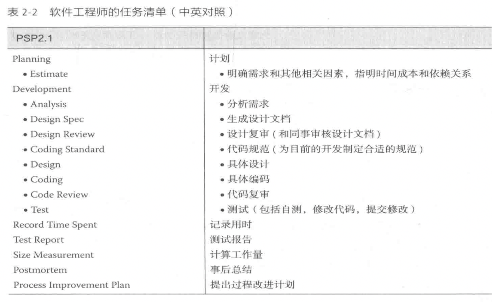
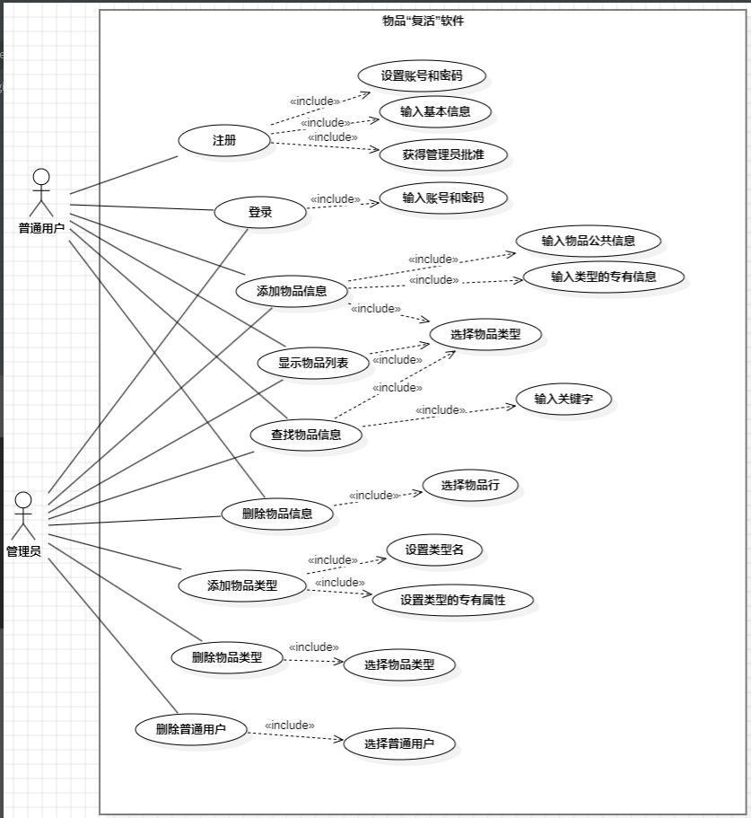
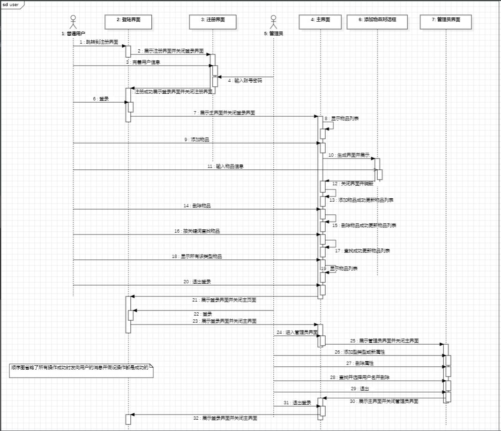
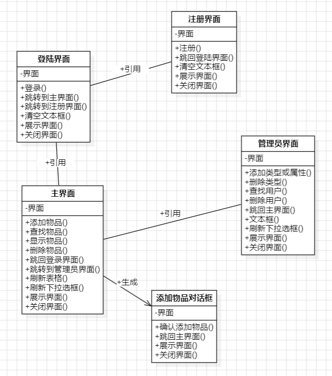

# 写在前面
- 本项目基于pyQt5和sqlite3，运行前请：
```
pip install PyQt5
```
- 运行main.py启动程序

# 项目要求：
>大学生经常有些物品觉得扔掉可惜，不处理又觉得浪费自己的地方。请你编写一个物品“复活”软件
>该程序允许添加物品的信息（物品名称，物品描述，联系人信息），删除物品的信息，显示物品列表，也允许查找物品的信息
>你实现的程序可以采用命令行方式使用，但是鼓励提供GUI
>程序实现完毕后，发布在Github上
>进行PSP数据的统计，发布在你的技术博客上（内容请按照下表）
>

>**文档需求：**
>1、需要提供一个文档：其中包括(1)用例模型；（2）针对用例画顺序图；（3）类图。
>
>**作业完成要求：**
>- 作业需要在16周前提交，并发布在你的Github仓库中；
>- 作业完成后需要进行演示（17周前完成），请提前一周与助教约好。（每周周二下午都可以约）；演示的内容包括写的文档、软件的功能。
>- 在技术博客上写一篇==总结文章==，对照软件工程的知识，对开发该程序的体会进行总结。
>
>**加分功能需求：**
>
>1、物品有公共的信息（物品名称，物品说明，物品所在地址，联系人手机，邮箱）。为了便于管理和查询，物品可以分成不同的类别（例如食品、书籍、工具等），不同类别的物品可能有不同的属性（例如食品有保质期，数量；书籍有作者，出版社等）。
>
>2、物品复活系统有两种类型的用户：管理员和普通用户。
>
>- 管理员可以设置新的物品类型（定义物品类型的名称和各个属性），修改物品类型。
>- 普通用户在添加物品时先选择物品类型，然后再填入物品信息。普通用户搜寻物品时，需要先选择类型，再输入关键字，关键字可以再用户名称和说明中进行匹配。
>
>普通用户需要注册（填入基本信息，包括住址，联系方式等），管理员批准后才能成为正式用户。
>
>3、为了便于使用上述功能，软件需要提供GUI。

# 用例模型

# 顺序图

- 某种程度上这样的顺序图一定是不典范的，因为一般一个用例会对应一张顺序图，但是由于时间预算不够。我的软件开发过程属于敏捷过程，针对每一个用例单独画顺序图的时间甚至可能占我为用例写函数时间的1/4，是不划算的，于是干脆将用例图调整一下，众所周知，只要我只有一个用例就只要画一张顺序图。

# 类图

# 演示视频
[物品“复活”|软件工程课程作业20241222软件测试录屏无解说版_哔哩哔哩_bilibili](https://www.bilibili.com/video/BV18cCKYUETX/?spm_id_from=333.1387.homepage.video_card.click&vd_source=d7bdc78fb6853c93b72d83dcfb93b2a1)
# 亿些说明
## 普通用户
- 初始界面为登录界面，普通用户需要先注册
- 进入注册界面，填写用户名、密码、确认密码、住址（可不填）、联系电话，由于为演示版本，要求的取得用户同意具象为注册时让管理员输入正确的账户和密码（后面的版本可以将同意注册加到管理员界面中），填写全部符合要求即注册通过。要求包括也不限于：用户名不重复、两次密码都正确，管理员账户密码正确、信息完备等。点击“取消”或“×”直接退回登录界面
- 退回登录界面，输入正确账户和密码即可进入主界面。
- 主界面功能：
	- 添加物品：选择“物品种类”（该下拉框会自动刷新），在弹出的界面中填满所有输入框，点击“确定”，返回主界面后列表自动刷新。
	- 删除物品：右击列表中某行，点击“删除”，列表自动刷新。
	- 显示物品：选择“物品种类”，列表自动刷新。
	- 查找物品：选择“物品种类”，在“关键字查找”中输入关键字，点击“查找”，会在名称和描述中查找匹配项并刷新列表。之后点击“查看全部”，列表刷新，可以查看该“物品种类”的全部物品。
	- 退出登录：在“更多操作”中，可以退回登录界面。（如果在主界面之间点击“×”会之间退出程序）
- 对违规的操作在本人可以想到的范围内都做了一定的提示或默认的跳转，程序在目前有限的α测试内没有崩溃。
## 管理员
- 登陆后包含普通用户的一切服务。
- 目前为设置管理员的注册方式。
- 更多服务（在主界面的在“更多操作”中点击“管理员选项”进入管理员界面）：
	- 添加种类或属性：如果没有该种类，添加该种类并添加属性（添加属性是在共有属性的基础上，共有属性包括：名称、联系人、地址、手机、邮箱、描述），如果有该种类，在该种类下添加属性。
	- 删除种类：删除选中的类，此时下拉框会自动刷新（添加种类也会刷新它）。
	- 删除普通用户：“查找”，用户名下拉框会刷新（因为这个功能不常用，所有不设计自动刷新），选中用户，即可删除。
	- “返回”或“×”：退回主界面，此时主界面中种类的下拉框也会刷新。
# 写在后面
- 该系统物品、类型、普通用户都有添加和删除操作，已经可以作为一个有一定生命周期的软件了，由于笔者实力和精力有限，下对其提出一定的展望：
	1. 界面中列表的显示方式比较古朴，很多时候放不满那个框，本人对Qt5这个库的理解有限，暂时没有找到好的办法。
	2. 虽然物品的相关操作已经满足了作业要求，但是实际上“改”这个操作没有完成，只能通过删除添加的操作完成，用户体验十分不好，我打算设计成在列表上直接改，但是这又回到了我对界面中列表的不熟悉的问题上了。
	3. 实际上对管理员的“修改类型”的操作也可以有很多改进的地方，比如能否删除属性或更改属性名、更改类型名，管理员界面实际可以做成一个功能更丰富的界面。
	4. 本人用的sqlite3是python自带的，是一个轻量级数据库，且它的版本较低，有一些复杂的数据库操作它并不能使用，在这方面软件如果要继续发展可能要进行一些预防性维护。